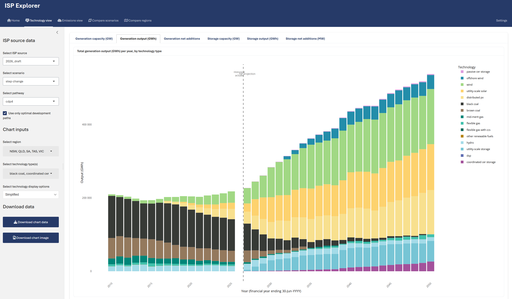
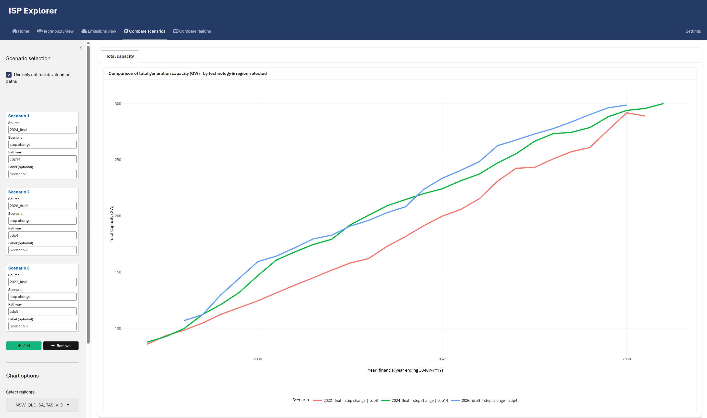

# ISP Explorer

An interactive Shiny web application for exploring and analysing Australia's [Integrated System Plan (ISP)](https://aemo.com.au/en/energy-systems/major-publications/integrated-system-plan-isp) data, published by the Australian Energy Market Operator (AEMO).

**[Launch the app](https://rpbatchelor-isp-explorer.share.connect.posit.cloud/)**

## About

The ISP is AEMO's whole-of-system plan for the efficient development of Australia's National Electricity Market (NEM) over the next 20+ years. It provides actionable information to support investment decisions in generation, storage, and transmission infrastructure.

ISP Explorer makes this data accessible through interactive charts and scenario comparisons, allowing users to explore how Australia's electricity system may evolve under different policy and technology assumptions.

## Features

### Technology View

Explore generation and storage trends across ISP scenarios:

- Generation capacity (GW) and output (GWh) by technology type
- Storage capacity and output analysis
- Net capacity additions and retirements
- Filter by region, scenario, pathway, and technology
- Overlay historical NEM data (FY2010-FY2025) from OpenNEM alongside ISP projections
- Download chart data and images

### Compare Scenarios

Compare up to three ISP scenarios side-by-side to understand how different assumptions affect projected capacity and generation mix:

## Data Sources

- **ISP data**: Extracted and processed from AEMO's official ISP publications (2022, 2024, 2026 draft)
- **Historical data**: NEM generation data sourced from [OpenNEM](https://opennem.org.au/)

## Disclaimer

The author of this application is not affiliated with AEMO and does not purport to represent its views. ISP data has been extracted, transformed, and manipulated based on official ISP data provided by AEMO. No guarantees or warranties are made for the accuracy of the data contained herein.

## Tech Stack

- **R** with **Shiny** and **bslib** for the web application
- **Plotly** for interactive charts
- **tidyverse** for data processing
- Hosted on [Posit Connect Cloud](https://connect.posit.cloud/)

## Author

Ryan Batchelor
